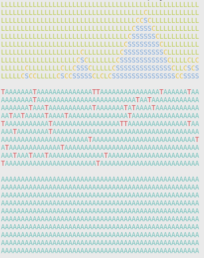

# Wavefunction Collapse

This is the example code for my blog post,
"The Wavefunction Collapse Algorithm explained
very clearly". To install dependencies:

```
virtualenv vendor
source vendor/bin/activate
pip install -r requirements.txt
```

Then to run:

```
python main.py
```

You will get a nice picture of a coastline.


# 3D

For the 3d version, run

```
python main-3d.py
```

You will get a nice picture of a coastline with trees and sky above


